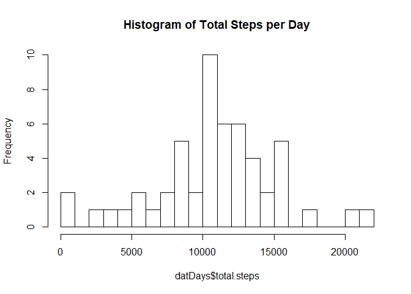
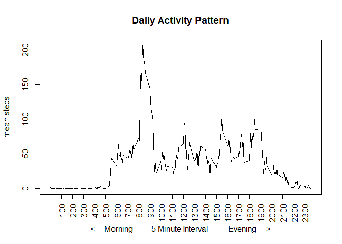
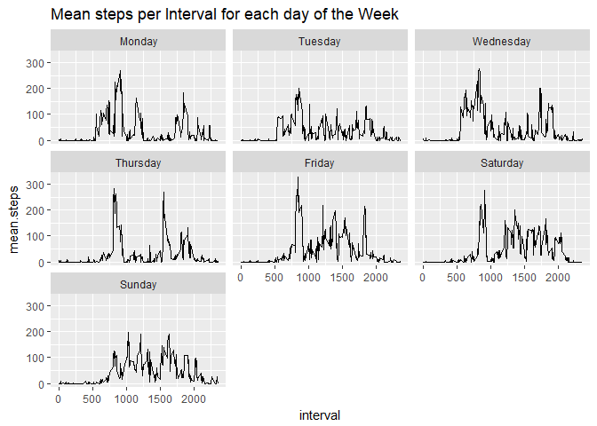
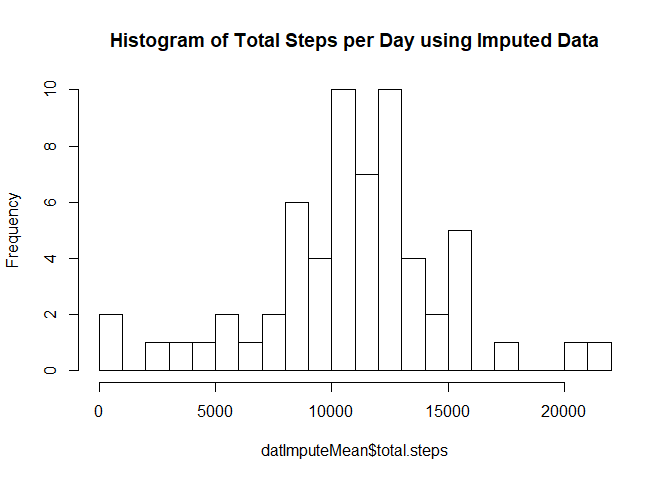
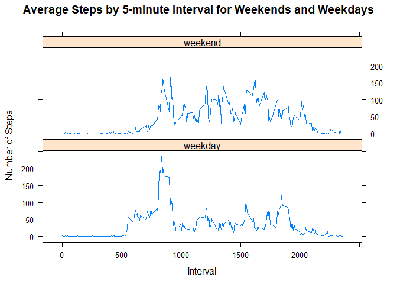

##Load Packages & Set Locale

Locale needs to be set because hardcode is used "Sunday" through "Saturday".


```r
library(dplyr)
```

```
## Warning: package 'dplyr' was built under R version 3.4.3
```

```
## 
## Attaching package: 'dplyr'
```

```
## The following objects are masked from 'package:stats':
## 
##     filter, lag
```

```
## The following objects are masked from 'package:base':
## 
##     intersect, setdiff, setequal, union
```

```r
library(ggplot2)
```

```
## Warning: package 'ggplot2' was built under R version 3.4.3
```

```r
library(lattice)

#Sys.setlocale("LC_MESSAGES", 'en_GB.UTF-8')
#Sys.setenv(LANG = "en_US.UTF-8")
Sys.setlocale("LC_TIME", "English")
```

```
## [1] "English_United States.1252"
```


## Loading and preprocessing the data

1. Load the data (i.e. read.csv())

Upzip if activity.csv doesn't exist, and then load the data.


```r
if(!file.exists('activity.csv')){
    unzip('activity.zip')
}
file <- "./activity.csv"
dat <- read.csv(file)
```

2. Process/transform the data (if necessary) into a format suitable for your analysis.
Don't need any Process/transform.
Show some records.


```r
head(dat)
```

```
##   steps       date interval
## 1    NA 2012-10-01        0
## 2    NA 2012-10-01        5
## 3    NA 2012-10-01       10
## 4    NA 2012-10-01       15
## 5    NA 2012-10-01       20
## 6    NA 2012-10-01       25
```


## What is mean total number of steps taken per day?

1. Calculate the total number of steps taken per day


```r
datDays <- dat %>% group_by(date) %>% summarise(total.steps = sum(steps))
```

2. Make a histogram of the total number of steps taken each day


```r
hist(datDays$total.steps,breaks=25,main = "Histogram of Total Steps per Day")
```

<!-- -->

3. Calculate and report the mean and median of the total number of steps taken per day


```r
meanStepsByDay <- mean(datDays$total.steps,na.rm = TRUE)
medianStepsByDay <- median(datDays$total.steps,na.rm = TRUE)
print(paste("Mean:",meanStepsByDay) )
```

```
## [1] "Mean: 10766.1886792453"
```

```r
print(paste("Median:",medianStepsByDay) )
```

```
## [1] "Median: 10765"
```

## What is the average daily activity pattern?

1. Make a time series plot (i.e. type = "l") of the 5-minute interval (x-axis) and the average number of steps taken, averaged across all days (y-axis)


```r
dat$interval.factor <- as.factor(dat$interval)
```


```r
datInterval <- dat %>% group_by(interval.factor) %>% summarise(mean.steps = mean(steps, na.rm =TRUE))
```


```r
datInterval$interval <- as.numeric(as.character(datInterval$interval.factor))
plot(datInterval$interval, datInterval$mean.steps, type = "l", xaxt="n", 
     xlab = "<--- Morning         5 Minute Interval          Evening --->", 
     ylab = "mean steps", main = "Daily Activity Pattern")
axis(1, at = seq(100, 2300, by = 100), las = 2)
```

<!-- -->

2. Which 5-minute interval, on average across all the days in the dataset, contains the maximum number of steps?


```r
maxSteps <- which.max(datInterval$mean.steps)
print(datInterval[maxSteps,])
```

```
## # A tibble: 1 x 3
##   interval.factor mean.steps interval
##            <fctr>      <dbl>    <dbl>
## 1             835   206.1698      835
```


## Imputing missing values

1. Calculate and report the total number of missing values in the dataset (i.e. the total number of rows with NAs)


```r
sum(is.na(dat$steps))
```

```
## [1] 2304
```

2. Devise a strategy for filling in all of the missing values in the dataset. The strategy does not need to be sophisticated. For example, you could use the mean/median for that day, or the mean for that 5-minute interval, etc.

The approach I use is to average the day of the week and replace the blank value with the corresponding average.


```r
dat$weekday <- weekdays(as.Date(dat$date,"%Y-%m-%d"))
dat$weekday <- factor(dat$weekday, levels= c("Monday", "Tuesday", "Wednesday", "Thursday", "Friday", "Saturday", "Sunday"))
```


```r
datDayNA <- dat %>% group_by(weekday) %>% summarise(sum(is.na(steps)))
```

```
## Warning: package 'bindrcpp' was built under R version 3.4.3
```

```r
print(datDayNA)
```

```
## # A tibble: 7 x 2
##     weekday `sum(is.na(steps))`
##      <fctr>               <int>
## 1    Monday                 576
## 2   Tuesday                   0
## 3 Wednesday                 288
## 4  Thursday                 288
## 5    Friday                 576
## 6  Saturday                 288
## 7    Sunday                 288
```


```r
datDays2 <- dat %>% group_by(weekday, interval.factor) %>% 
  summarise(mean.steps = mean(steps, na.rm =TRUE))

datDays2$interval <- as.numeric(as.character(datDays2$interval.factor))
ggplot(data=datDays2, aes(x=interval, y=mean.steps)) + geom_line() + facet_wrap(~weekday) +
labs(title = "Mean steps per Interval for each day of the Week")
```

<!-- -->

3. Create a new dataset that is equal to the original dataset but with the missing data filled in.


```r
datImpute <- merge(dat, datDays2, by=c("weekday","interval.factor"))
datImpute$impute.steps <- ifelse(is.na(datImpute$steps), 
                                       datImpute$mean.steps, datImpute$steps)
```

4. Make a histogram of the total number of steps taken each day and Calculate and report the mean and median total number of steps taken per day. Do these values differ from the estimates from the first part of the assignment? What is the impact of imputing missing data on the estimates of the total daily number of steps?


```r
datImputeMean <- datImpute %>% group_by(date) %>% 
  summarise(total.steps = sum(impute.steps))
hist(datImputeMean$total.steps, breaks = 25, 
     main = "Histogram of Total Steps per Day using Imputed Data")
```

<!-- -->

###


```r
mean(datImputeMean$total.steps)
```

```
## [1] 10821.21
```


```r
median(datImputeMean$total.steps)
```

```
## [1] 11015
```


## Are there differences in activity patterns between weekdays and weekends?

1. Create a new factor variable in the dataset with two levels – “weekday” and “weekend” indicating whether a given date is a weekday or weekend day.


```r
datImpute2 <- datImpute %>% 
  mutate(weekend = ifelse(weekday == "Saturday" | weekday == "Sunday", "weekend", "weekday"))
```

2. Make a panel plot containing a time series plot (i.e. type = "l") of the 5-minute interval (x-axis) and the average number of steps taken, averaged across all weekday days or weekend days (y-axis). See the README file in the GitHub repository to see an example of what this plot should look like using simulated data.

```r
datImputeMean <- datImpute2 %>% group_by(weekend, interval.x) %>% 
  summarise(mean.steps = mean(impute.steps))
xyplot(mean.steps ~ interval.x | weekend, data = datImputeMean, 
       type = "l", layout = c(1,2), xlab = "Interval", ylab = "Number of Steps", 
       main = "Average Steps by 5-minute Interval for Weekends and Weekdays")
```

<!-- -->

